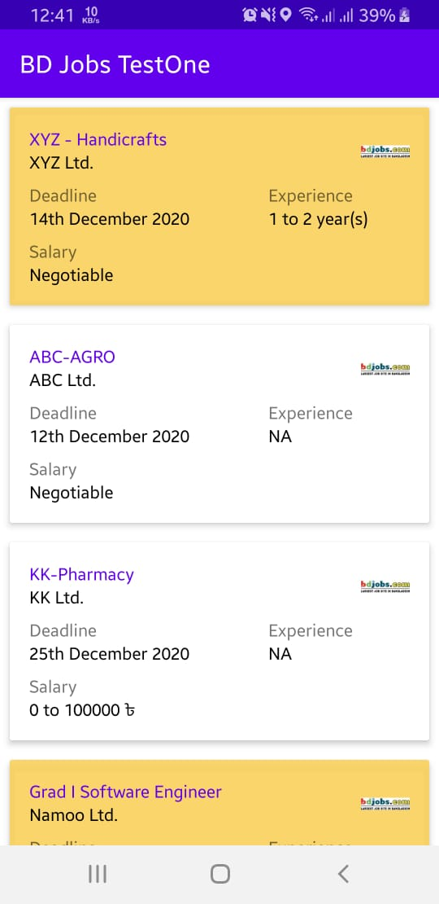
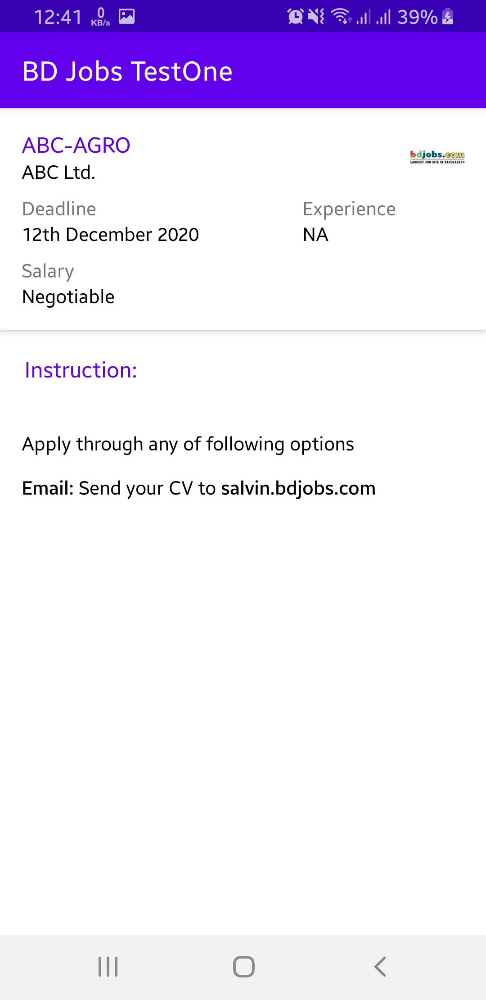

# BD-JOBS-Test1

<b>Q1: Implement the given API in Android Framework using Kotlin language (Encourage to implement in MVVM design pattern) - you can design the UI as you wish, following these requirements.</b>
 
1. 	Date format must be like - 1st July, 2021
2. 	Must show Salary range, if there is no range - it should show “Negotiable”
3. 	Must show the logo image
4. 	If “isFeatured” is true, highlight the item.
 
GET API: http://corporate3.bdjobs.com/interviewtest/InterviewJson.json

<b> Main Job List Screen </b> 

 
<b> Job Detail Screen </b> 

